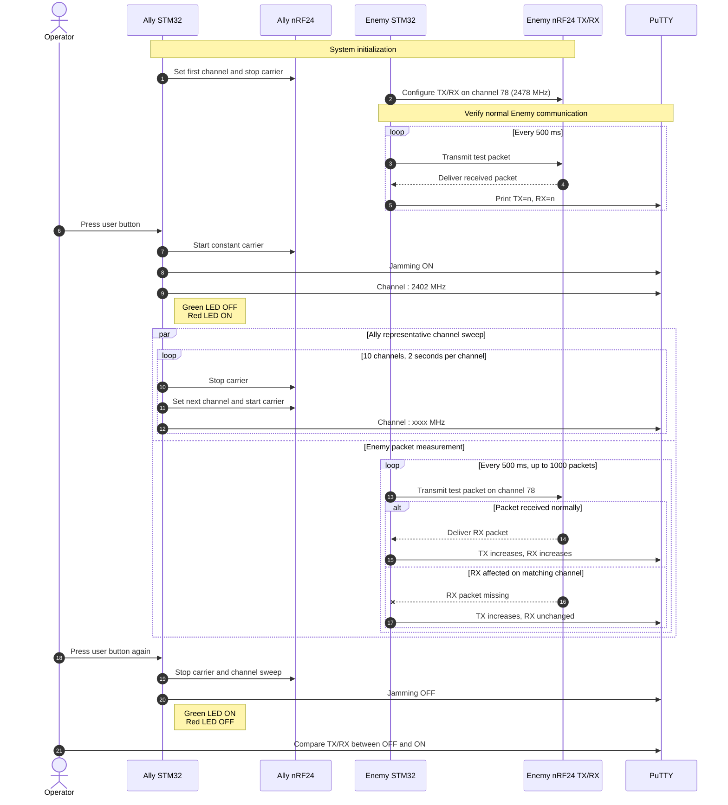

# LIG_SSEN_Jamming
- Side project : Make jamming signal. 

### [Team member]
- Eunhye Kim (김은혜)
- Ohreum Yoon (윤오름) 

### [Board and Module]
- Main Board : STM32F429I-DISC1
- Module : NRF24L01+PA+LNA 무선 트랜시버 RF 트랜시버 모듈 2.4GHz
- etc. : Capacitor 10uF/100uF, 리튬 이온 배터리 3.7V

### [Hardware images]  
- Ally  

  

- Ally + Enemy  

  

### [Demo video (PuTTY)]
  

### [Folder tree]
```text
├── Docs
│   └── Jamming project summary.pdf
├── Firmware
│   ├── Ally
│   │   └── STM32CubeIDE
│   │       └── jamming
│   │           ├── Core/
│   │           ├── Drivers/
│   │           ├── STM32F429ZITX_FLASH.ld
│   │           ├── STM32F429ZITX_RAM.ld
│   │           └── ally_jamming.ioc
│   └── Enemy
│       └── STM32CubeIDE
│           └── jamming
│               ├── Core/
│               ├── Drivers/
│               ├── STM32F429ZITX_FLASH.ld
│               ├── STM32F429ZITX_RAM.ld
│               └── enemy_jamming.ioc
├── KiCad_project/
├── LIG_SSEN_Jamming.code-workspace
└── README.md
```  

### [Sequence Diagram]



### [Circuit diagram]
[1] LIG_SSEN_Jamming\Firmware\Common\jamming
- Function : 1개의 STM 보드에 NRF 2개의 모듈을 사용하여, SPI 통신을 통해 Tx 모듈에서 나온 신호를 Rx 모듈로 받아 터미널에서 출력
- Verification results : PASS (2026-07-27)

